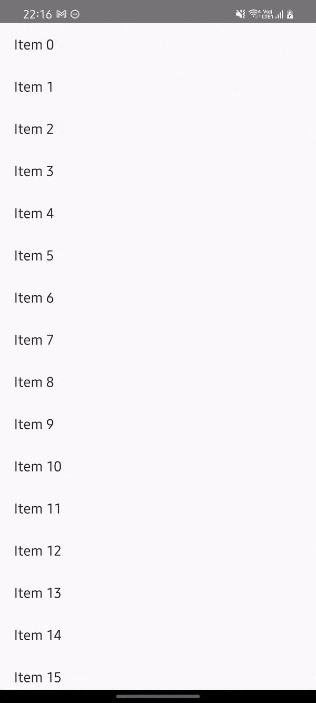

# Android ViewModel

```kotlin
class PostListScreen : Screen {

    @Composable
    override fun Content() {
        val viewModel = viewModel<PostListViewModel>()
        // ...
    }
}
```

By default Voyager provides its own `LocalViewModelStoreOwner` and `LocalSavedStateRegistryOwner`, that way you can safely create `ViewModel`s without depending on `Activity` or `Fragment`.

!!! info
    Voyager provides a similar implementation, the [ScreenModel](../screenmodel/README.md), which does the same as `ViewModel` but also works with [Compose Multiplatform](https://github.com/jetbrains/compose-jb).

### Sample



!!! info
    Source code [here](https://github.com/adrielcafe/voyager/tree/main/samples/android/src/main/java/cafe/adriel/voyager/sample/androidViewModel).
