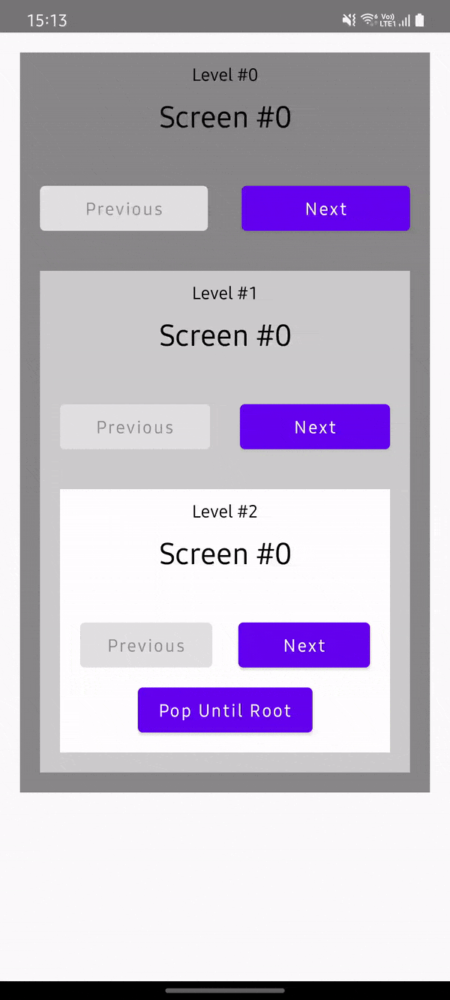

# Nested navigation

### Nested Navigators

Going a little further, it's possible to have nested navigators. The `Navigator` has a `level` property (so you can check how deeper your are) and can have a `parent` navigator (if you need to interact with it).

```kotlin
setContent {
    Navigator(ScreenA) { navigator0 ->
        println(navigator.level)
        // 0
        println(navigator.parent == null)
        // true
        Navigator(ScreenB) { navigator1 ->
            println(navigator.level)
            // 1
            println(navigator.parent == navigator0)
            // true
            Navigator(ScreenC) { navigator2 ->
                println(navigator.level)
                // 2
                println(navigator.parent == navigator1)
                // true
            }
        }
    }
}
```

Another operation is the `popUntilRoot()`, it will recursively pop all screens starting from the leaf navigator until the root one.

### Sample



!!! info
    Source code [here](https://github.com/adrielcafe/voyager/tree/main/samples/android/src/main/java/cafe/adriel/voyager/sample/nestedNavigation).