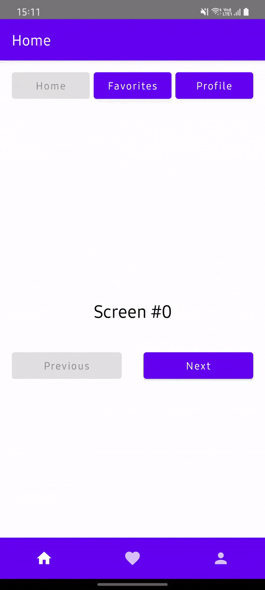

# Tab navigation

!!! success
    To use the `TabNavigator` you should first import `cafe.adriel.voyager:voyager-tab-navigator` (see [Setup](../setup.md)).

Voyager provides a specialized navigator for tabs : the `TabNavigator`.

The `Tab` interface, like the `Screen`, has a `Content()` composable function, but also requires a `TabOptions`.&#x20;

```kotlin
object HomeTab : Tab {

    override val options: TabOptions
        @Composable
        get() {
            val title = stringResource(R.string.home_tab)
            val icon = rememberVectorPainter(Icons.Default.Home)

            return remember {
                TabOptions(
                    index = 0u,
                    title = title,
                    icon = icon
                )
            }
        }

    @Composable
    override fun Content() {
        // ...
    }
}
```

!!! info
    Since tabs aren't usually reused, its OK to create them as `object`.

The `TabNavigator` unlike the `Navigator`:

* Doesn't handle [back presses](../back-press.md), because the tabs are siblings
* Doesn't implement the [Stack API](../stack-api.md), just provides a `current` property

You can use it with a [Scaffold](https://developer.android.com/reference/kotlin/androidx/compose/material/package-summary#Scaffold\(androidx.compose.ui.Modifier,androidx.compose.material.ScaffoldState,kotlin.Function0,kotlin.Function0,kotlin.Function1,kotlin.Function0,androidx.compose.material.FabPosition,kotlin.Boolean,kotlin.Function1,kotlin.Boolean,androidx.compose.ui.graphics.Shape,androidx.compose.ui.unit.Dp,androidx.compose.ui.graphics.Color,androidx.compose.ui.graphics.Color,androidx.compose.ui.graphics.Color,androidx.compose.ui.graphics.Color,androidx.compose.ui.graphics.Color,kotlin.Function1\)) to easily create the UI for your tabs.

```kotlin
setContent {
    TabNavigator(HomeTab) {
        Scaffold(
            content = { padding ->
                Box(modifier = Modifier.padding(padding)) {
                    CurrentTab()
                }
            },
            bottomBar = {
                BottomNavigation {
                    TabNavigationItem(HomeTab)
                    TabNavigationItem(FavoritesTab)
                    TabNavigationItem(ProfileTab)
                }
            }
        )
    }
}
```

!!! warning
    Like the`CurrentScreen()`, you should use `CurrentTab` instead of `tabNavigator.current.Content()`, because it will save the Tab's subtree for you (see [SaveableStateHolder](https://developer.android.com/reference/kotlin/androidx/compose/runtime/saveable/SaveableStateHolder)).

Use the `LocalTabNavigator` to get the current `TabNavigator`, and `current` to get and set the current tab.

```kotlin
@Composable
private fun RowScope.TabNavigationItem(tab: Tab) {
    val tabNavigator = LocalTabNavigator.current

    BottomNavigationItem(
        selected = tabNavigator.current == tab,
        onClick = { tabNavigator.current = tab },
        icon = { Icon(painter = tab.options.icon!!, contentDescription = tab.options.title) }
    )
}
```

### Sample



!!! info
    Source code [here](https://github.com/adrielcafe/voyager/tree/main/samples/android/src/main/java/cafe/adriel/voyager/sample/tabNavigation).

### TabNavigator + Nested Navigator

For more complex use cases, when each tab should have its own independent navigation, like the [Youtube app](https://play.google.com/store/apps/details?id=com.google.android.youtube), you can combine the `TabNavigator` with multiple `Navigator`s.

Let's go back to the [Tab navigation example](tab-navigation.md).

```kotlin
setContent {
    TabNavigator(HomeTab) {
        // ...
    }
}
```

But now, the `HomeTab` will have its own `Navigator`.

```kotlin
object HomeTab : Screen {

    @Composable
    override fun Content() {
        Navigator(PostListScreen())
    }
}
```

That way, we can use the `LocalNavigator` to navigate deeper into `HomeTab`, or the `LocalTabNavigator` to switch between tabs.

```kotlin
class PostListScreen : Screen {

    @Composable
    private fun GoToPostDetailsScreenButton(post: Post) {
        val navigator = LocalNavigator.currentOrThrow
        
        Button(
            onClick = { navigator.push(PostDetailsScreen(post.id)) }
        )
    }

    @Composable
    private fun GoToProfileTabButton() {
        val tabNavigator = LocalTabNavigator.current

        Button(
            onClick = { tabNavigator.current = ProfileTab }
        )
    }
}
```
