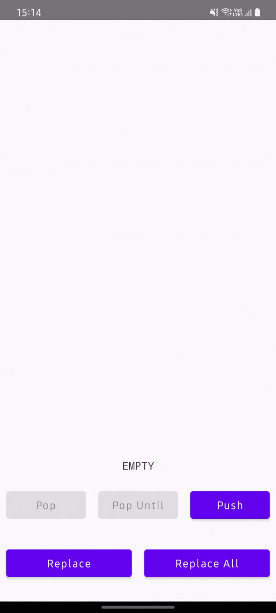

# Stack API

### SnapshotStateStack

Voyager is backed by a [SnapshotStateStack](https://github.com/adrielcafe/voyager/blob/main/voyager-core/src/main/java/cafe/adriel/voyager/core/stack/SnapshotStateStack.kt):

* Implementation of [Stack](https://github.com/adrielcafe/voyager/blob/main/voyager-core/src/main/java/cafe/adriel/voyager/core/stack/Stack.kt) that can be observed and snapshot
* Internally uses a [SnapshotStateList](https://developer.android.com/reference/kotlin/androidx/compose/runtime/snapshots/SnapshotStateList)
* State-aware: content change triggers a [recomposition](https://developer.android.com/jetpack/compose/mental-model#recomposition)

You will use it to navigate forward (`push`, `replace`, `replaceAll`) and backwards (`pop`, `popAll`, `popUntil`), but the `SnapshotStateStack` can also be used as a regular collection outside the `Navigator`.

```kotlin
val stack = mutableStateStackOf("🍇", "🍉", "🍌", "🍐", "🥝", "🍋")
// 🍇, 🍉, 🍌, 🍐, 🥝, 🍋

stack.lastItemOrNull
// 🍋

stack.push("🍍")
// 🍇, 🍉, 🍌, 🍐, 🥝, 🍋, 🍍

stack.pop()
// 🍇, 🍉, 🍌, 🍐, 🥝, 🍋

stack.popUntil { it == "🍐" }
// 🍇, 🍉, 🍌, 🍐

stack.replace("🍓")
// 🍇, 🍉, 🍌, 🍓

stack.replaceAll("🍒")
// 🍒
```

You can also create a `SnapshotStateStack` through `rememberStateStack()`, it will [restore the values](state-restoration.md) after Activity recreation.

### **Events**

Whenever the content changes, the `SnapshotStateStack` will emit a `StackEvent`. Use the `stack.lastEvent` to get the most recent one.

The available events are:

* `Push`: whenever `push` is called
* `Replace`: whenever `replace` and `replaceAll` are called
* `Pop`: whenever `pop` and `popAll` are called
* `Idle`: default event

This is very useful for deciding which [transition](transitions-api) to make.

### Sample



!!! info
    Source code [here](https://github.com/adrielcafe/voyager/tree/main/samples/android/src/main/java/cafe/adriel/voyager/sample/stateStack).
