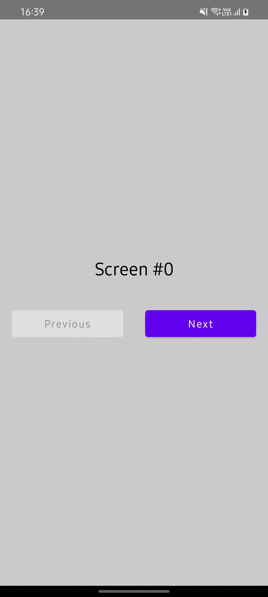

# Transitions

!!! success ""
    To use the transitions you should first import `cafe.adriel.voyager:voyager-transitions` (see [Setup](setup.md)).

Voyager has built-in transitions! When initializing the `Navigator` you can override the default content and use, for example, the `SlideTransition`.

```kotlin
setContent {
    Navigator(HomeScreen) { navigator ->
        SlideTransition(navigator)
    }
}
```

!!! error
    There is a know bug using any Transition APIs can leaky ScreenModels or ViewModels, this happens because Voyager by default
    dispose Screens in the next Composition tick after a `pop` or `replace` is called, but the transition only finish later, so
    the ScreenModel or ViewModel is re created or cleared to early. For this purpose since Voyager `1.1.0-beta02` we have introduce
    a new API to fix this issue. For more details on the issue see [#106](https://github.com/adrielcafe/voyager/issues/106).

    ```kotlin
    Navigator(
        screen = ...,
        disposeBehavior = NavigatorDisposeBehavior(disposeSteps = false),
    ) { navigator ->
        SlideTransition(
            navigator = navigator,
            ...
            disposeScreenAfterTransitionEnd = true
        )
    }
    ```

!!! warning
    Have encounter `Screen was used multiple times` crash? Provide a `uniqueScreenKey` for your Screens

    ```kotlin hl_lines="3 4"
    class ScreenFoo : Screen {
        
        override val key: ScreenKey
            get() = uniqueScreenKey
    
        @Composable
        override fun Content() {
            ...
        }
    ```

### **Available transitions**

|      `FadeTransition()`      |      `SlideTransition()`      |
|:----------------------------:|:-----------------------------:|
|  |  |

|      `ScaleTransition()`      |
|:-----------------------------:|
|  |

### Custom transitions

It's simple to add your own transitions: call `ScreenTransition` with a custom `transitionModifier`. Use the available params (`screen`, `transition` and `event`) to animate as needed.

```kotlin
@Composable
fun MyCustomTransition(
    navigator: Navigator,
    modifier: Modifier = Modifier,
    content: ScreenTransitionContent
) {
    ScreenTransition(
        navigator = navigator,
        modifier = modifier,
        content = content,
        transition = {
            val (initialScale, targetScale) = when (navigator.lastEvent) {
                StackEvent.Pop -> ExitScales
                else -> EnterScales
            }

            scaleIn(initialScale) with scaleOut(targetScale)
        }
    )
}

setContent {
    Navigator(HomeScreen) { navigator ->
        MyCustomTransition(navigator) { screen ->
            screen.Content()
        }
    }
}
```

!!! info ""
    Take a look at the [source of the available transitions](https://github.com/adrielcafe/voyager/tree/main/voyager-transitions/src/commonMain/kotlin/cafe/adriel/voyager/transitions) for working examples.

### Per Screen transitions [Experimental]

If you want to define a Enter and Exit transition for a specific Screen, you have a lot of options to do
starting from 1.1.0-beta01 Voyager have a new experimental API for this purpose.
To animate the content, we use transitions of the target screen in the case of push navigation, otherwise we use transitions of the initial screen 

```kotlin
class ExampleSlideScreen : Screen, ScreenTransition {
    override val key: ScreenKey
        get() = uniqueScreenKey

    @Composable
    override fun Content() {
        ...
    }

    override fun enter(lastEvent: StackEvent): EnterTransition {
        return slideIn { size ->
            val x = if (lastEvent == StackEvent.Pop) -size.width else size.width
            IntOffset(x = x, y = 0)
        }
    }

    override fun exit(lastEvent: StackEvent): ExitTransition {
        return slideOut { size ->
            val x = if (lastEvent == StackEvent.Pop) size.width else -size.width
            IntOffset(x = x, y = 0)
        }
    }
}
```

It's convenient to use Kotlin delegates for per-Screen transitions. For example, you can create a `SlideTransition` and `FadeTransition` classes:

```kotlin
class FadeTransition : ScreenTransition {

    override fun enter(lastEvent: StackEvent): EnterTransition {
        return fadeIn(tween(500, delayMillis = 500))
    }

    override fun exit(lastEvent: StackEvent): ExitTransition {
        return fadeOut(tween(500))
    }
}

class SlideTransition : ScreenTransition {

    override fun enter(lastEvent: StackEvent): EnterTransition {
        return slideIn { size ->
            val x = if (lastEvent == StackEvent.Pop) -size.width else size.width
            IntOffset(x = x, y = 0)
        }
    }

    override fun exit(lastEvent: StackEvent): ExitTransition {
        return slideOut { size ->
            val x = if (lastEvent == StackEvent.Pop) size.width else -size.width
            IntOffset(x = x, y = 0)
        }
    }
}
```

Then you can use them as delegates in your Screens:

```kotlin
class SlideScreen : Screen, ScreenTransition by SlideTransition() {

    @Composable
    override fun Content() {
        ...
    }
}

class FadeScreen : Screen, ScreenTransition by FadeTransition() {

    @Composable
    override fun Content() {
        ...
    }
}
```

Also you can use can pass your custom `ScreenTransition` instance in `ScreenTransition` function, it will be used for default animation.

```kotlin
setContent {
    Navigator(FadeScreen) { navigator ->
        ScreenTransition(
            navigator = navigator,
            defaultTransition = SlideTransition()
        )
    }
}
```

The API works with any ScreenTransition API, you just need to provide one and the Per Screen transition should.
```kotlin
setContent {
    Navigator(HomeScreen) { navigator ->
        SlideTransition(navigator)
    }
}
```

!!! warning ""
    `CrossfadeTransition` is not supported yet.